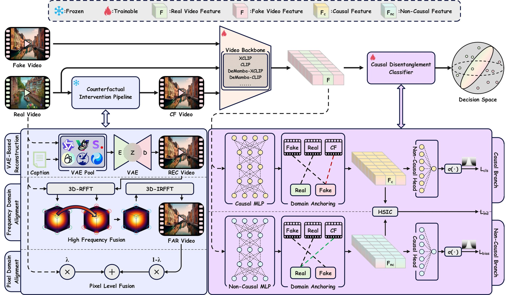

# G2VD

Anonymous implementation of **G2VD: Generalizable AI-Generated Video Detection
via Counterfactual Intervention and Causal Disentanglement**.

G2VD improves cross-generator AI-generated video detection by combining a
counterfactual intervention pipeline with a causal disentanglement classifier.
This repository provides the core training and evaluation code together with
editable configuration templates.

This repository is anonymized for double-blind review. Author, paper, and
repository metadata will be restored after the review period.

<p align="center">
  
</p>

<p align="center"><em>Overview of the G2VD framework.</em></p>

## Highlights

- Counterfactual intervention pipeline (CFIPipeline) based on a VAE pool,
  frequency-domain alignment, and pixel-domain fusion.
- Causal disentanglement classifier with causal and non-causal branches.
- Support for CLIP, XCLIP, DeMamba-CLIP, and DeMamba-XCLIP backbones.
- Reproduced baselines for AI-generated video and deepfake detection.
- Template-based configs for adapting the code to local dataset splits.

## Repository Layout

```text
G2VD/
  main.py                         # training entrypoint
  test.py                         # evaluation entrypoint
  configs/templates/              # editable train/test config templates
  assets/                         # README figures
  data/                           # dataloader and augmentation pipeline
  modules/                        # G2VD detector, CFIPipeline, CD classifier
  video_backbones/                # CLIP/XCLIP/DeMamba backbone wrappers
  baseline_models/                # reproduced baseline detectors
  vae_pool/                       # VAE pool used by CFIPipeline
  my_utils/                       # metrics, sampling, visualization, utilities
  dataset_metadata/               # metadata only; no videos are included
```

## Installation

Create a Python environment and install PyTorch with the CUDA version matching
your machine. For CUDA 12.4:

```bash
pip install -r requirements.txt --extra-index-url https://download.pytorch.org/whl/cu124
```

For other CUDA or CPU builds, install the matching PyTorch stack from the
official PyTorch instructions, then install the remaining packages listed in
`requirements.txt`. The file is a curated runtime dependency list rather than a
full `pip freeze` export.

You can check the local environment with:

```bash
python scripts/check_environment.py
```

## Data Preparation

Video files are not included. Please download datasets from their official
release channels and organize them under a dataset root, for example:

```text
/path/to/gvd_datasets/
  genvidbench-143k/
  genvideo-2271k/
  gvd-11k/
  gvf-2.8k/
```

The metadata files in `dataset_metadata/` use relative paths. Set
`dataset_root`, `*_metadata_dir`, and `*_video_data_list` in your copied config
to match your local split. See [DATA.md](DATA.md) for details.

## Training

Copy a template and edit the dataset/checkpoint fields:

```bash
cp configs/templates/train_g2vd_clip.yaml configs/local_train_g2vd_clip.yaml
```

Then run:

```bash
python main.py --config configs/local_train_g2vd_clip.yaml seed=42
```

The staged G2VD training protocol is:

1. `g2vd_wo_cfi_cd`: backbone detector without CFIPipeline or CD.
2. `g2vd_wo_cd`: adds CFIPipeline.
3. `g2vd`: adds CFIPipeline and causal disentanglement.

Templates are provided for the CLIP backbone and can be adapted to XCLIP,
DeMamba-CLIP, or DeMamba-XCLIP by changing `det_model.params.video_backbone`
and checkpoint paths.

Validate the release templates without launching training:

```bash
python scripts/check_config_templates.py
```

## Evaluation

Copy and edit the test template:

```bash
cp configs/templates/test_g2vd_clip.yaml configs/local_test_g2vd_clip.yaml
python test.py --config configs/local_test_g2vd_clip.yaml seed=42
```

The optional `test_g2vd_clip_with_jpeg.yaml` template illustrates how to add a
post-processing perturbation through `test_augmentation`.

## Baselines and Attribution

TimeSformer, VideoMAE, ViViT, XCLIP, and CLIP are based on Hugging Face or
Hugging Face compatible model calls. The other reproduced baselines follow the
public DeMamba implementation associated with:

> DeMamba: AI-generated video detection on million-scale GenVideo benchmark.

Please cite the original method and dataset papers used in your experiments.
See [THIRD_PARTY_NOTICES.md](THIRD_PARTY_NOTICES.md) for implementation-level
attribution. Citation information for G2VD will be restored after the review
period.

## Checkpoints

Model checkpoints and pretrained weights are not stored in git. Public G2VD
checkpoints will be listed in [MODEL_ZOO.md](MODEL_ZOO.md) once released.
The same file also describes the expected local layout for pretrained backbone
and VAE weights.

## Release Checks

The `scripts/` directory provides lightweight checks:

- `check_environment.py`: verifies whether key runtime packages are importable.
- `check_config_templates.py`: validates the release YAML templates without
  launching training.
- `audit_release.py`: scans for obvious private paths, credential-like text,
  and unexpected large files outside ignored output directories.

Before publishing a modified fork, run:

```bash
python scripts/check_environment.py
python scripts/check_config_templates.py
python scripts/audit_release.py
```

## Citation

Citation metadata is withheld during double-blind review and will be restored
after the review period. Please continue to cite the corresponding baseline and
dataset papers when using their implementations or evaluation data.

## License

Project-owned G2VD code is released under the Apache License 2.0. Third-party
components remain subject to their original licenses and usage terms. See
[LICENSE](LICENSE), [NOTICE](NOTICE), and
[THIRD_PARTY_NOTICES.md](THIRD_PARTY_NOTICES.md).
